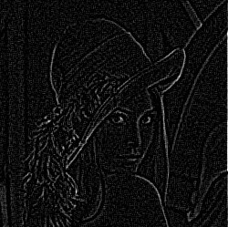

# Work On Your Figure !

Lena is given as a [pgm](https://en.wikipedia.org/wiki/Netpbm_format) format. The reading and the writting functions for the image is already implemented.

#### Tasks :
- Add padding to your image.

- Write a function to apply [convolution](https://en.wikipedia.org/wiki/Kernel_(image_processing)#Convolution).[A website for help](https://www.programming-techniques.com/2013/02/calculating-convolution-of-image-with-c_2.html).

- Use one of the following masks to apply it.

    - Edge detection 

   

    - Sharpen

   

    - Blur

    

- Parallelize the function for desired number of threads and for three cases : 
    - Row wise distribution
    - Column wise distribution
    - Cross distribution

### Example Output

